<div align="center">
  <p align="center">
    
  </p>
   <p><b>Ami: Adaptive Mentoring Intelligence</b></p>
  <p>A cognitive-style adaptive AI tutor built on GenMentor (WWW 2025)</p>
</div>

---

## Overview

Ami is an adaptive tutoring system that personalizes learning goals, learning paths, session content, quizzes, and tutoring support around each learner.

This repository started from [GenMentor](https://arxiv.org/pdf/2501.15749) (WWW 2025, Industry Track), but the current codebase extends that work into a fuller tutoring platform with persistent runtime state, verified-content grounding, adaptive learner modeling over time, and production-style backend/frontend integration.

The system is grounded in two pedagogical frameworks:

- **Felder-Silverman Learning Style Model (FSLSM)**: characterizes each learner across four dimensions (active/reflective, sensing/intuitive, visual/verbal, sequential/global) to shape content format and presentation
- **SOLO Taxonomy**: classifies cognitive complexity across five levels (pre-structural → extended abstract) to calibrate content difficulty and quiz depth

This repo contains:
- `backend/`: FastAPI backend for auth, goals/profiles, adaptive pipelines, tutoring runtime, analytics, and session prefetch
- `frontend/`: Streamlit frontend for onboarding, skill-gap analysis, learning paths, learning sessions, profiles, goals, and dashboard flows
- `frontend-react/`: React SPA — the current frontend (live at https://w0436300.github.io/Ami-React/)

Live app (Beta):
- [w0436300.github.io/Ami-React](https://w0436300.github.io/Ami-React/) — React frontend (current)

For testing / full feature access:
- [ami-dti5902-group5.streamlit.app](https://ami-dti5902-group5.streamlit.app) — Streamlit interface (includes features still being ported to React)

## Key Capabilities

- **Goal clarification and skill-gap analysis**: Ami can refine a vague goal into a clearer target, identify missing skills, and ground the analysis in verified course materials when available.
- **Adaptive learner modeling**: the learner profile is not fixed after onboarding. Cognitive status and FSLSM learning preferences can evolve based on edits, feedback, event history, tutoring interactions, and mastery outcomes.
- **Personalized learning paths and sessions**: Ami adapts session sequencing, structure, presentation style, and quiz difficulty using FSLSM and SOLO rather than serving the same lesson to every learner.
- **Multi-modal learning content**: generated sessions can include structured explanations, diagrams, external media, optional audio, and quizzes.
- **Tool-using tutor**: the tutor can ground answers in the current session, retrieve verified content, search the web when needed, surface media, and update learning preferences from strong signals.
- **Quality, safety, and analytics**: the backend includes explicit evaluation and bias-auditing layers, mastery checks, progress tracking, analytics, caching, and session prefetch.

## How Ami Works

| Stage | What the learner experiences | What the system does |
|---|---|---|
| Goal and skill gap | The learner gets a clearer goal statement and a list of missing skills | Goal parsing/refinement, optional verified-content retrieval, skill mapping, skill-gap evaluation, and bias audit |
| Learning path | The learner receives a personalized sequence of sessions | The scheduler generates a plan, applies FSLSM structural overrides, simulates feedback, and refines when needed |
| Learning session | The learner sees tailored lesson content, assets, and quizzes | The content pipeline explores knowledge points, drafts content, runs quality checks, enriches with media/narrative/audio when appropriate, and builds quizzes |
| Tutor support | The learner can ask follow-up questions during study | The tutor assembles tools at request time for session retrieval, verified-content lookup, web search, media search, and preference updates |
| Ongoing adaptation | Later sessions can feel different as the learner progresses | The learner profile updates through edits, event history, feedback, chatbot signals, and mastery results; downstream modules adapt accordingly |
| Runtime experience | Session transitions are faster and progress is tracked | The backend persists state, caches generated content, prefetches the next unlearned session, tracks mastery, and serves analytics |

## System Architecture

<div align="center">
  <p align="center">
    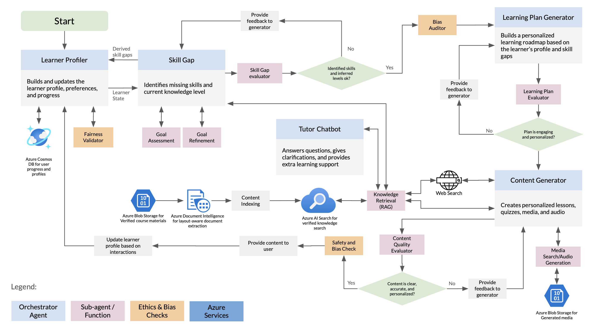
  </p>
</div>

### Core Backend Modules

1. **`skill_gap`**

   Clarifies goals, identifies skill gaps, retrieves supporting context when available, and audits the result for bias.

2. **`learner_profiler`**

   Creates and updates learner profiles, including cognitive status, FSLSM learning preferences, and profile adaptation over time.

3. **`learning_plan_generator`**

   Builds personalized learning paths, simulates learner feedback on those plans, and refines them when quality is not high enough.

4. **`content_generator`**

   Generates learning content through a staged pipeline with draft evaluation, integration checks, FSLSM-aware adaptation, media/audio enrichment, and quiz generation.

5. **`ai_chatbot_tutor`**

   Runs the conversational tutor ("Ami") with request-time tool assembly, grounded retrieval, and signal-gated learning preference updates.

### Runtime Services (Backend)

- Goal runtime-state computation
- Learning-content caching and prefetch (`services/content_prefetch.py`)
- Session activity and completion tracking
- Mastery evaluation and session mastery status
- Behavioral and dashboard analytics

## Ami vs. GenMentor

Ami started from [GenMentor](https://github.com/GeminiLight/gen-mentor), but the current project is substantially broader in scope.

- **Platform backend, not just generation endpoints**: Ami adds authentication, persistent goals, session runtime state, mastery tracking, analytics, caching, and prefetch.
- **Adaptive learner model over time**: Ami continuously updates cognitive status and FSLSM preferences, then uses those updates to adapt later plans, content, quizzes, and tutoring behavior.
- **Verified-content and tool-based grounding**: Ami adds verified-course-content retrieval and a tutor that can assemble tools at request time.
- **Richer delivery formats**: Ami supports diagrams, media enrichment, optional audio, and SOLO-aligned quizzes.
- **Explicit quality and bias controls**: Ami adds evaluator and auditing layers across skill gaps, learner profiles, generated content, learning plans, and chatbot responses.

## Tech Stack

- **Backend**: Python 3.13, FastAPI, LangChain, Hydra
- **Frontend**: React SPA (live at https://w0436300.github.io/Ami-React/)
- **Frontend (testing / full feature access)**: Streamlit (includes features still being ported to the React frontend)
- **Retrieval**: Azure AI Search indexes (`ami-verified-content`, `ami-web-results`) with OpenAI embeddings (`text-embedding-3-small`) + web search wrappers
- **Cloud Services**: Azure AI Search, Azure Blob Storage, Azure Cosmos DB, Azure Document Intelligence
- **Model Routing**: Provider/model overrides via `model_provider` and `model_name`
- **Testing/Evaluation**: Pytest test suites, LLM-as-a-judge eval scripts (RAGAS-based for RAG, rubric-based for agent quality)

## Getting Started

For service-specific setup details:
- Backend guide: [`backend/README.md`](backend/README.md)
- Frontend guide: [`frontend/README.md`](frontend/README.md)

### Quick Start (Local Dev)

#### Step 1 - Prepare backend environment

From repo root:

```bash
cp backend/.env.example backend/.env
```

Fill the required keys in `backend/.env`. For the current backend stack, that typically means:

- `OPENAI_API_KEY`
- `AZURE_SEARCH_ENDPOINT`
- `AZURE_SEARCH_KEY`
- `AZURE_STORAGE_CONNECTION_STRING`
- `AZURE_COSMOS_CONNECTION_STRING`
- `JWT_SECRET`

Set `AZURE_DOCUMENT_INTELLIGENCE_ENDPOINT` and `AZURE_DOCUMENT_INTELLIGENCE_KEY` as well if you plan to ingest or re-index verified course content from PDFs or slides.

#### Step 2 - Start backend on port 8000 (recommended)

```bash
BACKEND_PORT=8000 ./scripts/start_backend.sh
```

#### Step 3 - Start frontend in another terminal

```bash
./scripts/start_frontend.sh
```

#### Step 4 - Open services

- Frontend: `http://localhost:8501`
- Backend docs: `http://localhost:8000/docs`

### Quick Start (Docker)

Run each service from its directory:

```bash
# backend
cd backend
docker compose -f docker/docker-compose.yml up --build

# frontend (separate terminal)
cd frontend
docker compose -f docker/docker-compose.yml up --build
```

### Optional Helper Scripts

From repo root:

```bash
# Start both services in background (logs/ and pids/ managed by script)
BACKEND_PORT=8000 ./scripts/start_all.sh

# Stop services started by start_all.sh
./scripts/stop_all.sh
```

## Repository Layout

```text
Ami/
  backend/          # FastAPI backend, modules, configs, tests, evals, docker files; runtime data in backend/data/
  frontend/         # Streamlit frontend, pages/components/utils, tests, docker files
  frontend-react/   # React SPA (current frontend)
  docs/             # design notes, migration docs, testing guides
  scripts/          # local dev startup/stop scripts
  assets/           # architecture diagrams and Beta screenshots
```

## Interface Walkthrough

The screenshots below show the current React interface and key adaptive behaviors.

### 1. Register

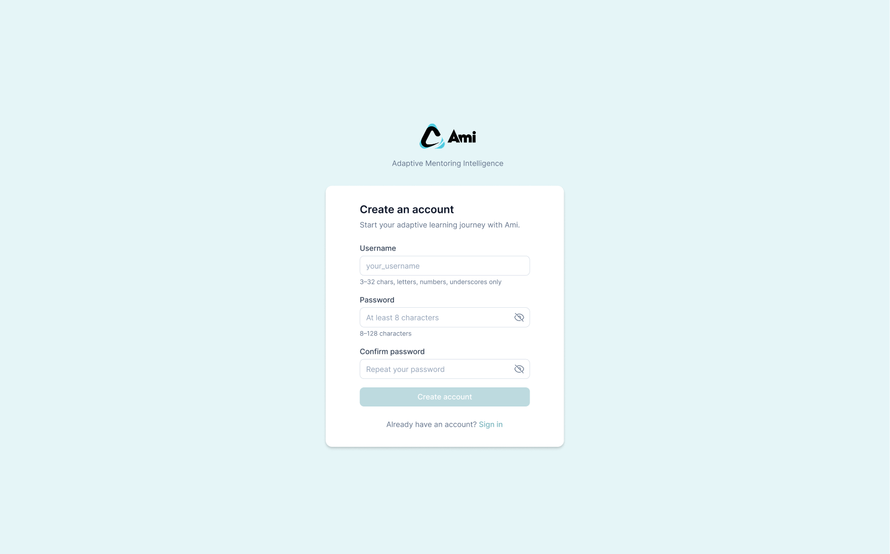

New learners create an account with a username and password to get started. After signing up, they are taken directly to the login screen.

### 2. Login

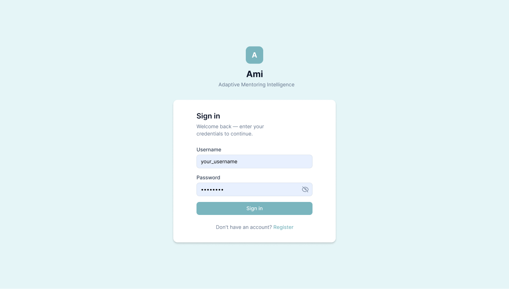

Returning learners sign in to pick up exactly where they left off — whether that is a learning session, a quiz, or a goal they are working toward.

### 3. Onboarding

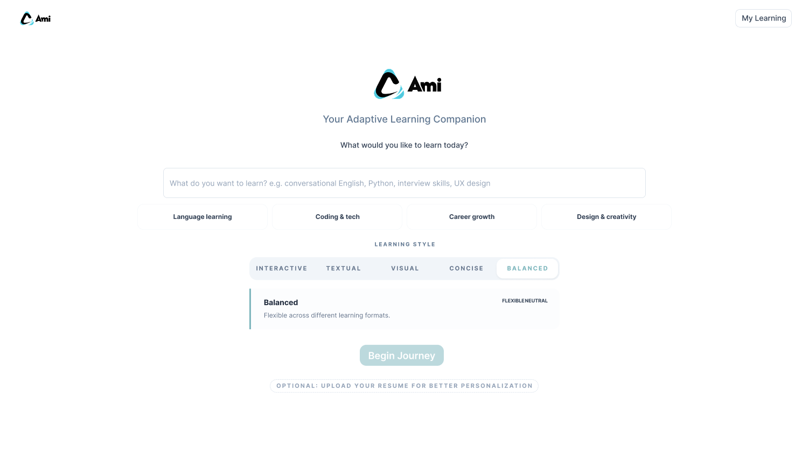

During onboarding, learners choose a learning persona that reflects how they best absorb information, describe their learning goal, and optionally upload a résumé to help Ami understand their background.

### 4. Skill Gap Identification

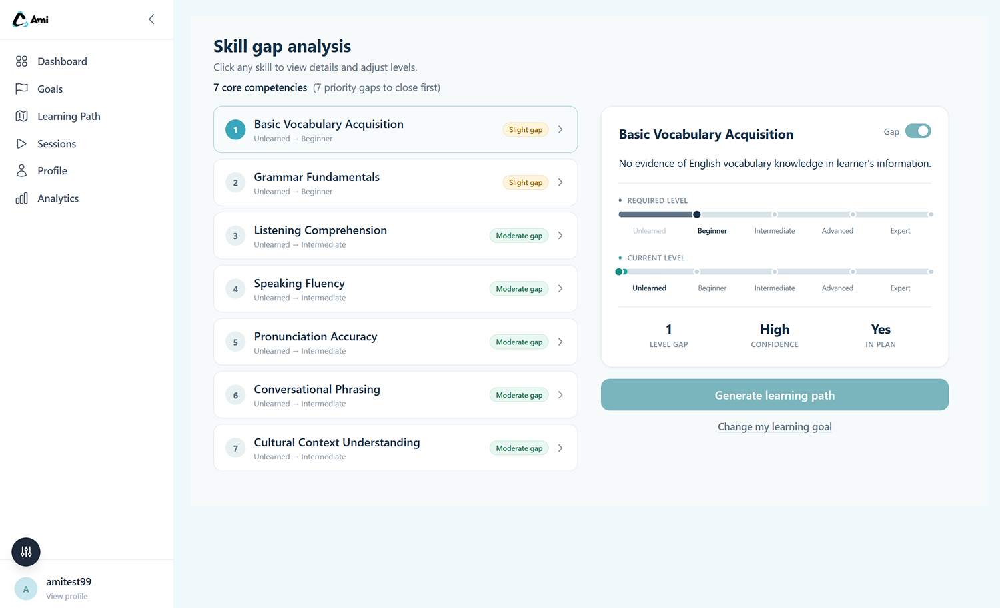

Ami refines the learner's goal into a clear target and surfaces the specific skills needed to get there, grounded in verified course materials and the learner's stated background.

| Verified Course Content | Fairness Check |
|---|---|
|  |  |

Left: skill gap output anchored in indexed course materials.
Right: a built-in fairness review flags any assumptions in the analysis that could disadvantage certain learners.

### 5. Learning Path Personalization

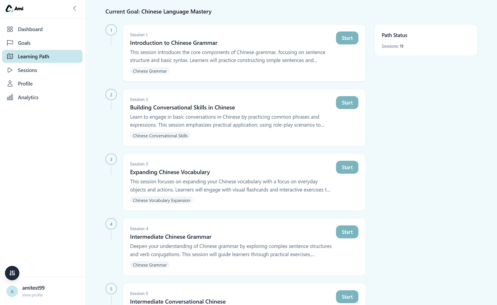

Ami builds a personalized sequence of sessions tailored to each learner's cognitive style and current knowledge level. Sessions are unlocked progressively as mastery is demonstrated.

### 6. Learning Session and Content Delivery

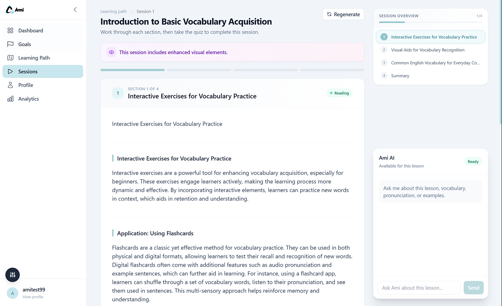

Each session delivers lesson content, visuals, optional audio, and embedded quizzes in a format matched to the learner's preferred style — whether that means diagrams and worked examples or narrative explanations and structured outlines.


Before presenting a learning path, Ami runs a self-evaluation loop to ensure the plan is coherent, well-sequenced, and appropriate for the learner's level.

### 7. Adaptive Quizzes and Knowledge Checks

| Foundational-Level Quiz | Intermediate-Level Quiz |
|---|---|
|  |  |

Left: quiz questions calibrated for learners building foundational understanding.
Right: quiz questions for learners ready to apply and connect concepts across topics.


Open-ended responses are evaluated by an AI grader aligned with the SOLO Taxonomy — a research-backed framework that measures how deeply a learner understands a topic.

### 8. Ami Chatbot Tutor


Ami is available throughout the learning experience as a conversational tutor. Learners can ask follow-up questions, request clarifications, or explore related topics — and Ami draws on the current session content, verified course materials, and the web to respond.

### 9. Dashboard

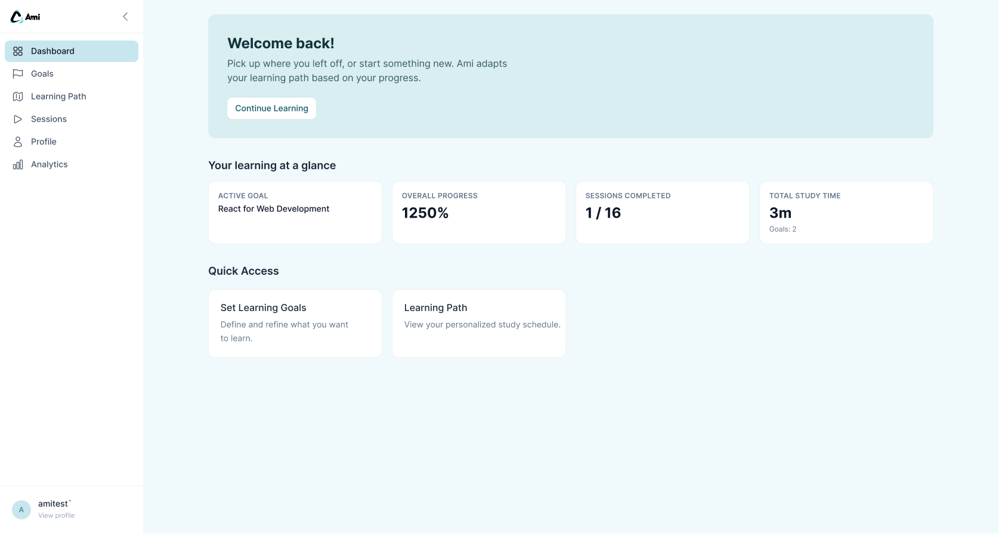

The home dashboard gives learners a clear view of their active goal, current progress, and the next recommended step in their learning journey.

### 10. Learner Profile

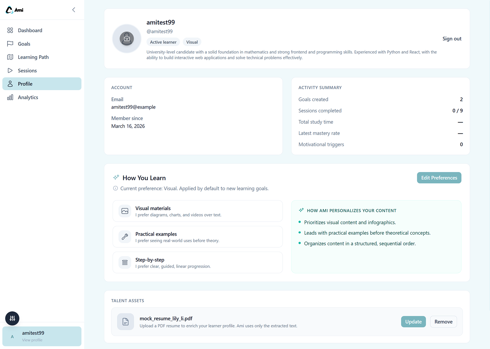

The learner profile tracks cognitive progress, learning style preferences, and behavioral signals accumulated across sessions — giving learners and instructors a transparent view of how the personalization is working.

### 11. Edit Profile

| Learning Style Preferences | Personal Information |
|---|---|
|  |  |

Learners can update their learning style preferences and personal background information independently, so changes in one area do not affect the other.

### 12. Goal Management

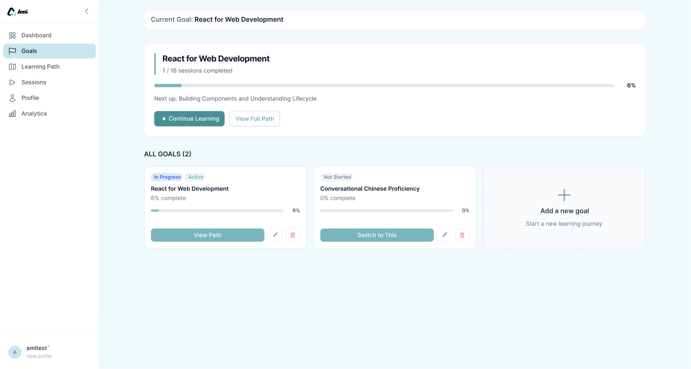

Learners can create, switch between, and manage multiple learning goals — making it easy to pursue different topics or return to something set aside earlier.

### 13. Learning Analytics

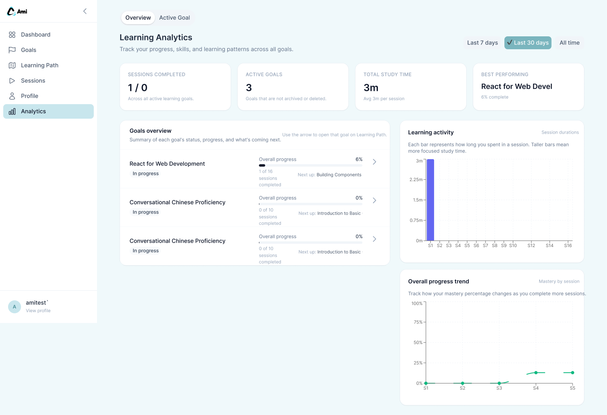

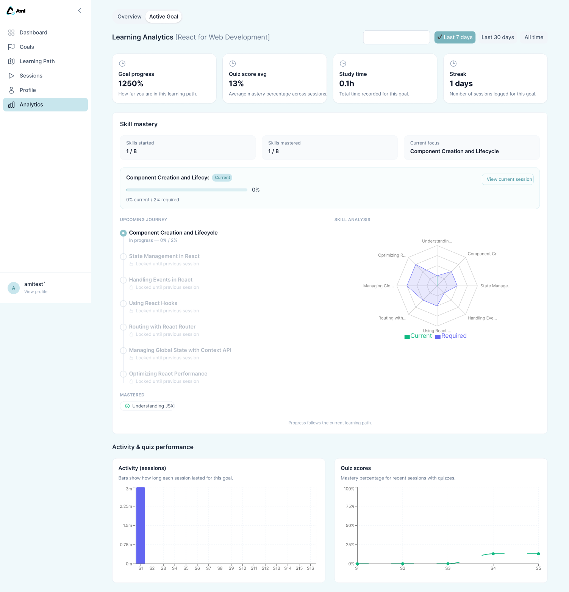

The analytics dashboard surfaces progress, skill mastery, session time, and quiz performance — helping learners understand how they are advancing and where to focus next.

## Project Context

This project is developed as part of **GNG 5902 (Winter 2026)** at the University of Ottawa.

- **Client**: Dr. Ali Abbas — CEO of Smart Digital Medicine, Adjunct Professor at uOttawa
- **Technical Advisor**: Prof. Ismaeel Al-Ridhawi — Associate Professor, School of Electrical Engineering and Computer Science, uOttawa

### Team (Group 5)

| Member | Role |
|---|---|
| Thuy Tran | Project Manager / Project Coordinator |
| Nellie Le | Learning Researcher |
| Mico Comia | Technical Lead (Multi-agent AI & LLM Integration) |
| Tianci Li | Technical & Ethical Framework |
| Tian Lai | UX Design Lead |
| Xinping Wang | UX Engineer |

## References

1. T. Wang et al., "LLM-powered Multi-agent Framework for Goal-oriented Learning in Intelligent Tutoring System," WWW '25, May 2025. [Paper](https://arxiv.org/pdf/2501.15749)
2. M. Rizvi, "Investigating AI-Powered Tutoring Systems that Adapt to Individual Student Needs," EPESS, vol. 31, Oct. 2023.
3. Biggs, J. B., & Collis, K. F. (1982). *Evaluating the Quality of Learning: The SOLO Taxonomy*. Academic Press.
4. Felder, R. M., & Silverman, L. K. (1988). "Learning and teaching styles in engineering education." *Engineering Education*, 78(7), 674-681.

## Original Citation

```bibtex
@inproceedings{wang2025llm,
  title={LLM-powered Multi-agent Framework for Goal-oriented Learning in Intelligent Tutoring System},
  author={Wang, Tianfu and Zhan, Yi and Lian, Jianxun and Hu, Zhengyu and Yuan, Nicholas Jing and Zhang, Qi and Xie, Xing and Xiong, Hui},
  booktitle={Companion Proceedings of the ACM Web Conference},
  year={2025}
}
```
