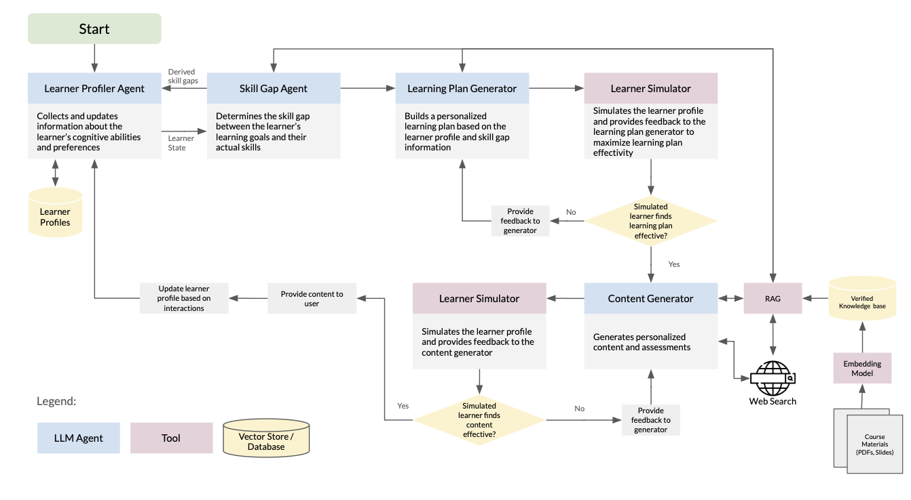

<div align="center">
  <p align="center">
    
  </p> 
   <p><b>Ami: Adaptive Mentoring Intelligence</b></p>
  <p>A cognitive-style adaptive AI tutor — an enhanced fork of GenMentor (WWW 2025)</p>
</div>

---

## Overview

This repository is a fork of [GenMentor](https://arxiv.org/pdf/2501.15749) (WWW 2025, Industry Track). Ami extends the original goal-oriented tutoring direction with explicit orchestration layers for quality control, reflexion pipelines, and production-style backend/frontend integration.

The system is grounded in two pedagogical frameworks:

- **Felder-Silverman Learning Style Model (FSLSM)**: characterizes each learner across four dimensions (active/reflective, sensing/intuitive, visual/verbal, sequential/global) to drive content format and presentation
- **SOLO Taxonomy**: classifies cognitive complexity across five levels (pre-structural → extended abstract) to calibrate content difficulty and quiz depth

Problem: adaptive tutoring systems typically collapse content planning, skill-gap detection, and response generation into a single pass. Ami introduces tighter control loops — parse/critique/refine steps, quality evaluators, targeted repair, ethics/bias auditing, and request-time tool routing — to improve reliability and personalization.

This repo contains:
- `backend/`: FastAPI backend (auth, goals/profiles, reflexion pipelines, content generation with quality gates, session runtime, analytics, session prefetch)
- `frontend/`: Streamlit frontend (auth-gated onboarding, skill-gap and plan flows, learning content sessioning, profile, dashboard) — a React SPA is under active development for the Beta release

## Ami Enhancements

### 1. Skill Gap Reflexion + Bias Auditing

- **Loop 1 (goal clarification)**: `GoalContextParser ↔ LearningGoalRefiner`
- **Loop 2 (skill-gap critique/refinement)**: `SkillGapIdentifier ↔ SkillGapEvaluator`
- **Post-loop audit (always run)**: `BiasAuditor` checks for demographic or confidence-level bias in skill gap assumptions

Implemented in `identify_skill_gap_with_llm`. Separates goal-specific refinement from skill-gap quality evaluation, with bias auditing as a mandatory gate.

### 2. Learning Plan Reflexion

- Initial schedule generation (`LearningPathScheduler.schedule_session`)
- Plan quality simulation via embedded feedback simulator (integrated into the plan pipeline, not a separate module)
- Reflexion pass(es) using evaluator directives (`LearningPathScheduler.reflexion`)

Implemented by `schedule_learning_path_agentic` with bounded refinement iterations.

### 3. Content Generation Quality Pipeline

The orchestrator runs a staged pipeline with two embedded reflexion loops:

`explore → draft → [deterministic + LLM draft checkpoints] → targeted draft repair → integrate → final quality checkpoint → targeted repair / fallback`

- **Draft reflexion loop**: `KnowledgeDraftEvaluator` evaluates each knowledge point draft; failed sections are repaired before integration
- **Integration reflexion loop**: `IntegratedDocumentEvaluator` evaluates the full document; targeted repair (`integrator_only` or `section_redraft`) runs on failure, with a fallback path when the quality budget is exhausted
- FSLSM-aware content adaptation (`fslsm_adaptation.py`) tailors format per learner style
- Multi-modal enrichment: TTS audio generation, media search (videos/diagrams/podcasts), ASCII diagram rendering

Implemented in `generate_learning_content_with_llm` in `modules/content_generator/`.

### 4. Tutor Tool-Fetching Architecture

Ami (the chatbot tutor) assembles tools at request time based on per-request toggles:

| Tool | Purpose |
|---|---|
| `retrieve_session_learning_content` | Access current session's learning document for context-aware answers |
| `retrieve_vector_context` | Verified-content RAG retrieval from indexed course materials |
| `search_web_context_ephemeral` | Ephemeral web search (non-persistent) |
| `search_media_resources` | Search and filter media resources (video, diagram, podcast) |
| `update_learning_preferences_from_signal` | Signal-gated FSLSM profile updates from tutoring interactions |

Implemented through `AITutorChatbot._build_runtime_tools` and `create_ai_tutor_tools`.

### 5. Adaptive Learner Profile Updates

The learner profile is not static after onboarding — it evolves throughout the learning lifecycle through three update channels:

- **Manual edit**: The learner explicitly adjusts FSLSM dimensions via sliders (`update_learning_preferences_with_llm` → `/update-learning-preferences`) or updates background/bio via text and optional resume re-upload (`update_learner_information_with_llm` → `/update-learner-information`). These two paths are scoped separately to prevent unintended cross-field changes.
- **Quiz-driven cognitive progression**: Mastery evaluation outcomes drive `update_cognitive_status_with_llm`, tracking SOLO level advancement session-over-session.
- **Chatbot signal-gated updates**: When Ami detects a strong learning preference signal during tutoring (e.g., "I prefer visual explanations"), the `update_learning_preferences_from_signal` tool applies a preference update — but only when signal confidence and user/goal context are both present.

Implemented in `AdaptiveLearningProfiler` (`modules/learner_profiler/`) and the chatbot tool `update_learning_preferences_from_signal`.

### 6. Session Prefetch

`ContentPrefetchService` (`services/content_prefetch.py`) prefetches upcoming learning sessions in the background while a learner works through their current session. This reduces wait time at session transitions without blocking the current session flow.

## System Architecture

<div align="center">
  <p align="center">
    
  </p>
</div>

### Core Backend Modules

1. **`skill_gap`**

   Goal refinement, skill-gap identification, bias auditing. Two-loop reflexion with mandatory `BiasAuditor` post-loop.

2. **`learner_profiler`**

   Learner profile creation and multi-channel updates. FSLSM-driven adaptation utilities; scoped update endpoints (FSLSM dimensions vs. learner information updated separately); quiz-driven SOLO cognitive status progression; signal-gated preference updates from chatbot interactions; and fairness validation.

3. **`learning_plan_generator`**

   Learning-path scheduling with embedded plan feedback simulation and agentic regeneration workflows.

4. **`content_generator`**

   Staged content generation pipeline with draft evaluation, FSLSM-aware adaptation, media enrichment (audio/TTS, media search, diagrams), and quiz generation.

5. **`ai_chatbot_tutor`**

   Conversational tutoring agent ("Ami") with request-time tool assembly and signal-gated learner preference updates.

### Runtime Services (Backend)

- Goal runtime-state computation
- Learning-content caching and prefetch (`services/content_prefetch.py`)
- Session activity and completion tracking
- Mastery evaluation and session mastery status
- Behavioral and dashboard analytics

## Tech Stack

- **Backend**: Python 3.13, FastAPI, LangChain, Hydra, ChromaDB
- **Frontend (current)**: Streamlit
- **Frontend (Beta, in development)**: React SPA
- **Retrieval**: Verified-content vector indexing (HuggingFace `all-mpnet-base-v2`) + web search wrappers
- **Model Routing**: Provider/model overrides via `model_provider` and `model_name`
- **Testing/Evaluation**: Pytest test suites, LLM-as-a-judge eval scripts (RAGAS-based for RAG, rubric-based for agent quality)

## Getting Started

For service-specific setup details:
- Backend guide: [`backend/README.md`](backend/README.md)
- Frontend guide: [`frontend/README.md`](frontend/README.md)

### Quick Start (Local Dev)

#### Step 1 - Prepare backend environment

From repo root:

```bash
cp backend/.env.example backend/.env
```

Fill API keys and `JWT_SECRET` in `backend/.env`.

#### Step 2 - Start backend on port 8000 (recommended)

```bash
BACKEND_PORT=8000 ./scripts/start_backend.sh
```

#### Step 3 - Start frontend in another terminal

```bash
./scripts/start_frontend.sh
```

#### Step 4 - Open services

- Frontend: `http://localhost:8501`
- Backend docs: `http://localhost:8000/docs`

### Quick Start (Docker)

Run each service from its directory:

```bash
# backend
cd backend
docker compose -f docker/docker-compose.yml up --build

# frontend (separate terminal)
cd frontend
docker compose -f docker/docker-compose.yml up --build
```

### Optional Helper Scripts

From repo root:

```bash
# Start both services in background (logs/ and pids/ managed by script)
BACKEND_PORT=8000 ./scripts/start_all.sh

# Stop services started by start_all.sh
./scripts/stop_all.sh
```

## Repository Layout

```text
Ami/
  backend/       # FastAPI backend, modules, configs, tests, docker files
  frontend/      # Streamlit frontend, pages/components/utils, tests, docker files
  docs/          # design notes, migration docs, testing guides
  scripts/       # local dev startup/stop scripts
  resources/     # architecture diagrams and MVP screenshots
  data/          # runtime data artifacts (vectorstore db files, user JSON)
```

## Project Context

This project is developed as part of **GNG 5902 (Winter 2026)** at the University of Ottawa.

- **Client**: Dr. Ali Abbas — CEO of Smart Digital Medicine, Adjunct Professor at uOttawa
- **Technical Advisor**: Prof. Ismaeel Al-Ridhawi — Associate Professor, School of Electrical Engineering and Computer Science, uOttawa

### Team (Group 5)

| Member | Role |
|---|---|
| Thuy Tran | Project Manager / Project Coordinator |
| Nellie Le | Learning Researcher |
| Mico Comia | Technical Lead (Multi-agent AI & LLM Integration) |
| Tianci Li | Technical & Ethical Framework |
| Tian Lai | UX Design Lead |
| Xinping Wang | UX Engineer |

## Interface Walkthrough

The screenshots below show the current Beta interface and key adaptive behaviors.

### 1. Login


Login interface for returning users to authenticate and access personalized learning sessions.

### 2. Onboarding


Onboarding flow where learners select a learning persona (maps to FSLSM dimensions), define a learning goal, and optionally upload a resume.

### 3. Skill Gap Identification


Skill gap analysis grounded in verified course materials and the learner's stated background.

| Verified Content Context | Bias Audit |
|---|---|
|  |  |

Left: skill gap output grounded in indexed course materials via RAG.
Right: `BiasAuditor` output flagging potentially biased assumptions in the skill gap analysis.

### 4. Learning Path Personalization (FSLSM)

| Active-Sensing-Visual-Sequential Persona | Reflective-Intuitive-Verbal-Global Persona |
|---|---|
|  |  |

Learning paths personalized by FSLSM profile. Session sequencing and scope are adapted to the learner's cognitive style and SOLO level.

### 5. Learning Session and Content Delivery

| Visual Persona (Part 1) | Visual Persona (Part 2) |
|---|---|
|  |  |


Content delivery for a verbal/reflective persona, prioritizing narrative explanation and sequential structure.


Plan quality reflexion output: the agentic scheduler evaluates and refines the learning path via embedded plan feedback simulation before presenting it to the learner.

### 6. Adaptive Quizzes and SOLO-based Assessment

| Beginner-Level Quiz | Intermediate-Level Quiz |
|---|---|
|  |  |

Left: quiz calibrated for foundational (pre-structural/uni-structural) SOLO level.
Right: quiz calibrated for intermediate (multi-structural/relational) SOLO level.


Open-ended response assessment graded by an LLM judge aligned with SOLO taxonomy rubrics.

### 7. Ami Chatbot Tutor


Conversational tutor ("Ami") with request-time tool assembly: session content retrieval, verified-content RAG, web search, media search, and signal-gated FSLSM preference updates.

### 8. Learner Profile

| Learner Information and Cognitive Status | Learning Preferences and Patterns |
|---|---|
|  |  |

Left: current cognitive status (SOLO level) and learner background.
Right: FSLSM learning style dimensions and behavioral signals accumulated from sessions.

### 9. Edit Profile

| FSLSM Edit | Learner Information Edit |
|---|---|
|  |  |

FSLSM dimension updates and personal/background information updates are separated into distinct edit flows to prevent unintended cross-field changes.

### 10. Goal Management


Goal Management page for creating, selecting, and switching among multiple learning goals.

### 11. Learning Analytics


Learning Analytics dashboard showing progress, performance, and engagement metrics over time.

## References

1. T. Wang et al., "LLM-powered Multi-agent Framework for Goal-oriented Learning in Intelligent Tutoring System," WWW '25, May 2025. [Paper](https://arxiv.org/pdf/2501.15749)
2. M. Rizvi, "Investigating AI-Powered Tutoring Systems that Adapt to Individual Student Needs," EPESS, vol. 31, Oct. 2023.
3. Biggs, J. B., & Collis, K. F. (1982). *Evaluating the Quality of Learning: The SOLO Taxonomy*. Academic Press.
4. Felder, R. M., & Silverman, L. K. (1988). "Learning and teaching styles in engineering education." *Engineering Education*, 78(7), 674-681.

## Original Citation

```bibtex
@inproceedings{wang2025llm,
  title={LLM-powered Multi-agent Framework for Goal-oriented Learning in Intelligent Tutoring System},
  author={Wang, Tianfu and Zhan, Yi and Lian, Jianxun and Hu, Zhengyu and Yuan, Nicholas Jing and Zhang, Qi and Xie, Xing and Xiong, Hui},
  booktitle={Companion Proceedings of the ACM Web Conference},
  year={2025}
}
```
