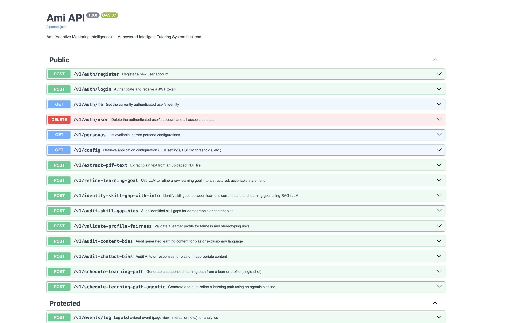

# Backend of Ami

Ami's backend is a FastAPI service that powers authentication, learner/profile persistence, skill-gap analysis with bias auditing, adaptive learning-path generation, multi-modal content generation with quality gates, session prefetch, runtime orchestration, and analytics.

It is designed to work with the Streamlit frontend in `../frontend`, but can also be used directly through the API.

## What This Backend Provides

- **Authentication and accounts** (`/auth/*`)
- **Goal lifecycle and multi-goal state** (`/goals/*`)
- **Learner profile creation, update, and sync** (`/profile/*`, `/sync-profile/*`) — FSLSM dimensions and learner information are updated via separate scoped endpoints
- **Skill-gap analysis with two-loop reflexion and bias/fairness auditing**
- **Learning-path scheduling and agentic adaptation** with embedded plan feedback simulation
- **Content generation** — staged quality pipeline with evaluators, FSLSM-aware adaptation, and multi-modal enrichment (audio/TTS, media search, diagrams)
- **Session content caching and prefetch** (`services/content_prefetch.py`)
- **Session activity tracking and mastery evaluation**
- **Behavioral and dashboard analytics**

## Architecture Overview

### Core entry points

- `main.py`: FastAPI app and endpoint orchestration
- `api_schemas.py`: request/response Pydantic schema classes
- `config/`: Hydra configuration

### Main module packages

- `modules/skill_gap/`
- `modules/learner_profiler/`
- `modules/learning_plan_generator/`
- `modules/content_generator/`
- `modules/ai_chatbot_tutor/`

### Supporting services/utilities

- `services/content_prefetch.py`: background prefetch of upcoming sessions while learner is in current session (single-flight coordination, configurable concurrency)
- `base/llm_factory.py`: model client initialization for multiple providers
- `base/search_rag.py`: retrieval and verified-content integration
- `base/verified_content_manager.py` + `base/verified_content_loader.py`: indexes PDFs/slides from `resources/verified-course-content/`; tracks changes to avoid re-indexing
- `utils/store.py`: JSON-backed runtime persistence
- `utils/auth_store.py`, `utils/auth_jwt.py`: auth persistence and JWT token handling
- `utils/solo_evaluator.py`: SOLO Taxonomy rubric-based quiz assessment
- `utils/quiz_scorer.py`: quiz evaluation logic

## Key Module Architecture

### `skill_gap` module

Primary orchestration entrypoint: `identify_skill_gap_with_llm`

- Runs an explicit two-loop reflexion flow:
  - Loop 1: `GoalContextParser` and `LearningGoalRefiner` (goal clarification only)
  - Loop 2: `SkillGapIdentifier` and `SkillGapEvaluator` (skill-gap critique/refinement only)
- Computes top-level `goal_assessment` and `retrieved_sources`
- Always executes `BiasAuditor` post-loop as a mandatory ethics gate — checks for demographic or confidence-level bias in skill gap assumptions

### `learner_profiler` module

Primary agent: `AdaptiveLearningProfiler`

The learner profile evolves throughout the lifecycle via three update channels:

- **Manual edit** (user-initiated): `update_learning_preferences_with_llm` (FSLSM sliders) and `update_learner_information_with_llm` (background/bio + optional resume) — scoped separately to prevent cross-field changes
- **Quiz-driven cognitive progression** (automated): `update_cognitive_status_with_llm` — advances SOLO level based on mastery evaluation outcomes
- **Chatbot signal-gated** (interaction-driven): `update_learning_preferences_from_signal` in `ai_chatbot_tutor` — applies FSLSM preference updates only when strong preference signals and user/goal context are both present

Additional:
- `initialize_learner_profile_with_llm` — creates initial FSLSM + SOLO profile from persona and optional resume
- `update_learner_profile_with_llm` — full profile update
- `fslsm_adaptation.py` utility handles FSLSM vector updates and adaptation logic
- `FairnessValidator` agent validates profiles for bias

### `learning_plan_generator` module

Primary orchestration entrypoint: `schedule_learning_path_agentic`

- Generates initial path with `LearningPathScheduler.schedule_session`
- Evaluates plan quality via embedded plan feedback simulator (`PlanFeedbackSimulator`)
- Uses `LearningPathScheduler.reflexion` with evaluator directives when quality threshold is not met
- Returns both `learning_path` and iteration metadata

### `content_generator` module

Primary orchestration entrypoint: `generate_learning_content_with_llm`

Staged pipeline with two embedded reflexion loops:

1. **Knowledge exploration** — `GoalOrientedKnowledgeExplorer` identifies key concepts for the goal
2. **Draft generation** — `SearchEnhancedKnowledgeDrafter` drafts knowledge points using RAG + web search
3. **Draft reflexion loop** — deterministic audits + `KnowledgeDraftEvaluator` (LLM) evaluate each draft; failed sections undergo targeted repair before proceeding
4. **Integration** — `LearningDocumentIntegrator` merges all components into a coherent document
5. **Integration reflexion loop** — `IntegratedDocumentEvaluator` evaluates the full document; targeted repair (`integrator_only`, `section_redraft`) runs on failure; fallback path when quality budget is exhausted

Additional capabilities:
- **FSLSM-aware adaptation** (`fslsm_adaptation.py`): tailors content format and style to learner's FSLSM profile
- **Media enrichment**: `MediaResourceFinder` + `MediaRelevanceEvaluator` for external videos/diagrams/podcasts; `DiagramRenderer` for ASCII diagrams; `TTSGenerator` for audio
- **Quiz generation**: `DocumentQuizGenerator` produces SOLO-aligned quizzes

### `ai_chatbot_tutor` module

Runtime tool-fetching entrypoints:
- `AITutorChatbot._build_runtime_tools`
- `create_ai_tutor_tools`

Per-request tool assembly; each tool can be individually enabled/disabled:

| Tool | Purpose |
|---|---|
| `retrieve_session_learning_content` | Access current session's learning document |
| `retrieve_vector_context` | Verified-content RAG from indexed course materials |
| `search_web_context_ephemeral` | Ephemeral web search (non-persistent) |
| `search_media_resources` | Search and filter media resources |
| `update_learning_preferences_from_signal` | Signal-gated FSLSM profile updates |

Preference updates are signal-gated: profile writes occur only when strong preference signals are detected and user/goal context is present.

## Quickstart

### Option A: Docker (Recommended)

#### Step 1 — Prepare `.env`

From `backend/`:

```bash
cp .env.example .env
```

Open `.env` and fill in at least one LLM key (for example `OPENAI_API_KEY`) and a secure `JWT_SECRET`.

#### Step 2 — Build and run

From `backend/`:

```bash
docker compose -f docker/docker-compose.yml up --build
```

When startup completes, backend will be available at:

- API base: `http://localhost:8000`
- API docs: `http://localhost:8000/docs`

#### Step 3 — Stop

```bash
docker compose -f docker/docker-compose.yml down
```

#### Docker notes

- Compose maps host `8000` to container `8000`.
- Compose mounts:
  - `../data` -> `/app/data`
  - `../resources` -> `/app/resources`
- Data persists across container restarts through mounted directories.

### Option B: Local Python (venv)

#### Prerequisites

- Python 3.13
- `pip`

#### Cross-Platform Notes (Windows / macOS / Linux)

All dependencies in `requirements.txt` are cross-platform compatible. Key details:

| Package | Notes |
|---|---|
| `torch`, `torchvision` | CPU wheels from PyPI work on Windows, macOS (Intel + Apple Silicon), and Linux. No extra index URL needed. |
| `opencv-python-headless` | Headless variant — no system GUI libraries required. Works identically on all platforms. |
| `onnxruntime` | Pre-built wheels available for Windows, macOS, and Linux. |
| `pyclipper`, `grpcio`, `brotli` | C extensions with pre-built wheels for all major platforms. |
| `rapidocr` | Depends on `onnxruntime`; works wherever onnxruntime works. |

**Windows-specific:** Use `python -m venv .venv` then `.venv\Scripts\activate` (backslash, no `source`).

**macOS Apple Silicon:** If `pip install` fails for any native package, ensure you are using a native ARM Python (not Rosetta). Run `python -c "import platform; print(platform.machine())"` — should print `arm64`.

#### Step 1 — Install dependencies

From repo root:

```bash
python -m venv .venv
source .venv/bin/activate       # macOS/Linux
# .venv\Scripts\activate        # Windows
pip install -r backend/requirements.txt
```

#### Step 2 — Configure env

```bash
cp backend/.env.example backend/.env
```

Fill keys in `backend/.env`.

#### Step 3 — Start backend

Recommended (for frontend compatibility):

```bash
./scripts/start_backend.sh 8000
```

Alternative direct run from `backend/`:

```bash
uvicorn main:app --reload --host 0.0.0.0 --port 8000
```

### Option C: Local Python (Conda)

```bash
conda create -n ami-backend python=3.13 -y
conda activate ami-backend
pip install -r backend/requirements.txt
cp backend/.env.example backend/.env
./scripts/start_backend.sh 8000
```

## Ports and Startup Behavior

Important current defaults:

- Docker backend: **8000**
- `./scripts/start_backend.sh` default: **5000** if no argument and no `BACKEND_PORT`

For default frontend behavior, run backend on **8000**:

```bash
./scripts/start_backend.sh 8000
# or
BACKEND_PORT=8000 ./scripts/start_backend.sh
```

## Environment Variables

`backend/.env.example` currently includes:

```bash
TOGETHER_API_KEY=...
DEEPSEEK_API_KEY=...
OPENAI_API_KEY=...

SERPER_API_KEY=...
BING_SUBSCRIPTION_KEY=...
BING_SEARCH_URL=...
BRAVE_API_KEY=...

USER_AGENT=Ami/1.0 (educational-platform)
JWT_SECRET=change-me-to-a-random-string-in-production
```

Guidance:

- Set at least one working LLM key.
- Keep `JWT_SECRET` strong and private.
- Search provider keys are needed only if you use those providers.

## Configuration (Hydra)

Backend config files:

- `config/main.yaml`
- `config/default.yaml`

Current repo defaults include:

- `llm.provider: openai`
- `llm.model_name: gpt-4o`
- `search.provider: duckduckgo`
- `vectorstore.persist_directory: data/vectorstore`
- `verified_content.enabled: true`
- `prefetch.enabled: true` (configures background session prefetch)

The backend also exposes runtime config via:

- `GET /config`

## Request Interface Notes

Many generation/profile endpoints share a base schema that accepts optional model overrides:

- `model_provider`
- `model_name`

If omitted, backend uses configured defaults.

`/chat-with-tutor` also supports additive optional request controls:

- retrieval/search/media toggles (`use_vector_retrieval`, `use_web_search`, `use_media_search`)
- preference-update toggle (`allow_preference_updates`)
- contextual identifiers (`user_id`, `goal_id`, `session_index`)
- `return_metadata` mode for structured tutor responses (`response`, `profile_updated`, optional updated profile payload)

## Interactive API Documentation

The backend exposes a full Swagger UI at runtime:

- **Swagger UI**: `http://localhost:8000/docs`
- **OpenAPI schema**: `http://localhost:8000/openapi.json`

All endpoints are listed and can be tested directly from the browser. Endpoints are split into **Public** (no auth required) and **Protected** (requires `Authorization: Bearer <token>` header) sections.



## API Endpoint Map

### Auth

- `POST /auth/register`
- `POST /auth/login`
- `GET /auth/me`
- `DELETE /auth/user`

### Goals and Profiles

- `GET /goals/{user_id}`
- `POST /goals/{user_id}`
- `PATCH /goals/{user_id}/{goal_id}`
- `DELETE /goals/{user_id}/{goal_id}`
- `GET /profile/{user_id}`
- `PUT /profile/{user_id}/{goal_id}`
- `POST /sync-profile/{user_id}/{goal_id}`
- `POST /propagate-profile/{user_id}/{goal_id}`
- `POST /profile/auto-update`

### Runtime and Content

- `GET /goal-runtime-state/{user_id}`
- `GET /learning-content/{user_id}/{goal_id}/{session_index}`
- `DELETE /learning-content/{user_id}/{goal_id}/{session_index}`
- `POST /session-activity`
- `POST /complete-session`
- `POST /submit-content-feedback`

### Generation and Planning

- `POST /chat-with-tutor`
- `POST /refine-learning-goal`
- `POST /identify-skill-gap-with-info`
- `POST /audit-skill-gap-bias`
- `POST /create-learner-profile-with-info`
- `POST /validate-profile-fairness`
- `POST /update-learner-profile`
- `POST /update-cognitive-status`
- `POST /update-learning-preferences`
- `POST /update-learner-information`
- `POST /schedule-learning-path`
- `POST /schedule-learning-path-agentic`
- `POST /adapt-learning-path`
- `POST /draft-knowledge-point`
- `POST /generate-learning-content`
- `POST /simulate-content-feedback`

### Analytics and Assessment

- `GET /dashboard-metrics/{user_id}`
- `GET /behavioral-metrics/{user_id}`
- `GET /quiz-mix/{user_id}`
- `GET /session-mastery-status/{user_id}`
- `POST /evaluate-mastery`

### Utility and Ops

- `GET /config`
- `GET /personas`
- `GET /list-llm-models`
- `POST /extract-pdf-text`
- `POST /events/log`
- `GET /events/{user_id}`
- `DELETE /user-data/{user_id}`

## Example API Calls

### Chat with tutor

```bash
curl -X POST "http://localhost:8000/v1/chat-with-tutor" \
  -H "Content-Type: application/json" \
  -H "Authorization: Bearer <token>" \
  -d '{
    "messages": "[{\"role\":\"user\",\"content\":\"Help me learn recursion\"}]",
    "learner_profile": "{}",
    "model_provider": "openai",
    "model_name": "gpt-4o"
  }'
```

### Agentic schedule learning path

```bash
curl -X POST "http://localhost:8000/v1/schedule-learning-path-agentic" \
  -H "Content-Type: application/json" \
  -d '{
    "learner_profile": "{\"learning_goal\":\"Learn Python\"}",
    "session_count": 8,
    "model_provider": "openai",
    "model_name": "gpt-4o"
  }'
```

## Persistence and Data Paths

Backend-managed runtime data:

- `backend/data/users/*.json`
  - users, goals, profiles, events, session activity, mastery history, cached learning content
- `backend/data/vectorstore/`
  - runtime vectorstore files (ChromaDB)
- `backend/data/audio/`
  - generated audio served via `/static/audio`
- `backend/data/diagrams/`
  - generated diagrams served via `/static/diagrams`

Verified source corpus location:

- `backend/resources/verified-course-content/`

On startup, backend loads persisted stores and syncs verified content indexing as configured.

## Project Structure (Backend)

```text
backend/
  main.py
  api_schemas.py
  requirements.txt

  config/
    main.yaml
    default.yaml
    loader.py
    schemas.py

  base/
    base_agent.py
    dataclass.py
    llm_factory.py
    rag_factory.py
    embedder_factory.py
    searcher_factory.py
    search_rag.py
    verified_content_manager.py
    verified_content_loader.py

  services/
    content_prefetch.py

  modules/
    ai_chatbot_tutor/
    skill_gap/
    learner_profiler/
    learning_plan_generator/
    content_generator/

  utils/
    store.py
    auth_store.py
    auth_jwt.py
    solo_evaluator.py
    quiz_scorer.py
    llm_output.py

  evals/
  tests/
  docker/
```

## Testing

From `backend/`:

```bash
python -m pytest tests
```

Tests mock all LLM calls via `unittest.mock` — no API keys or network access are required. Tests use FastAPI's `TestClient`.

## Common Dev Commands

From repo root:

```bash
# backend only (foreground)
./scripts/start_backend.sh 8000

# backend + frontend (background with pid/log files)
BACKEND_PORT=8000 ./scripts/start_all.sh

# stop both when started by start_all.sh
./scripts/stop_all.sh
```

## Troubleshooting

| Problem | Likely Cause | Fix |
|---|---|---|
| `docker: command not found` | Docker missing / PATH issue | Install Docker Desktop and restart terminal |
| `Cannot connect to Docker daemon` | Docker not running | Start Docker Desktop fully |
| Port `8000` already in use | Another process is bound | Stop that process or map a different host port |
| Frontend cannot call backend | Backend running on `5000` via script default | Start backend with `./scripts/start_backend.sh 8000` |
| 401 responses | Missing/invalid token | Use `/auth/login` and send `Authorization: Bearer <token>` |
| Model/provider call errors | Missing API key or wrong provider/model | Verify `.env` keys and request `model_provider`/`model_name` |
| No media URLs working | Data directories unavailable | Check `backend/data/audio` and `backend/data/diagrams` write access |
| Sparse/empty analytics | Insufficient runtime events/sessions | Exercise session endpoints and complete sessions first |

## License

This project is released under the repository's top-level license.
