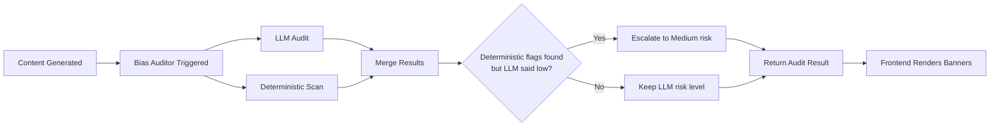
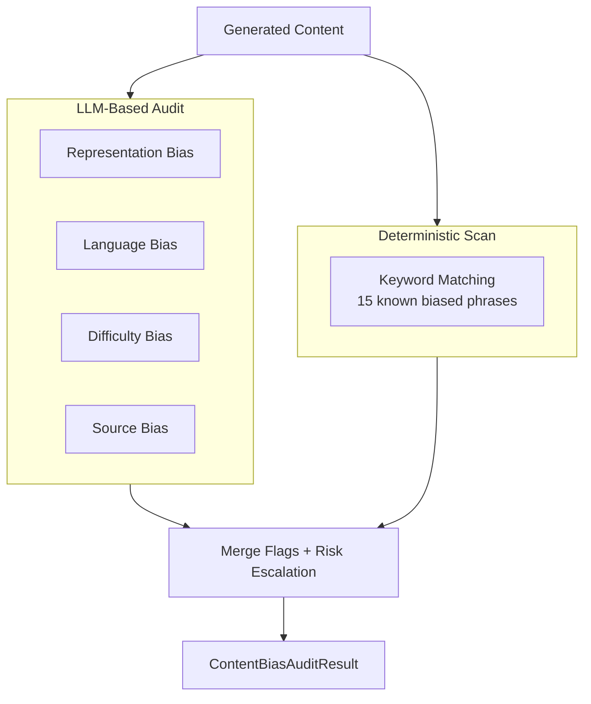
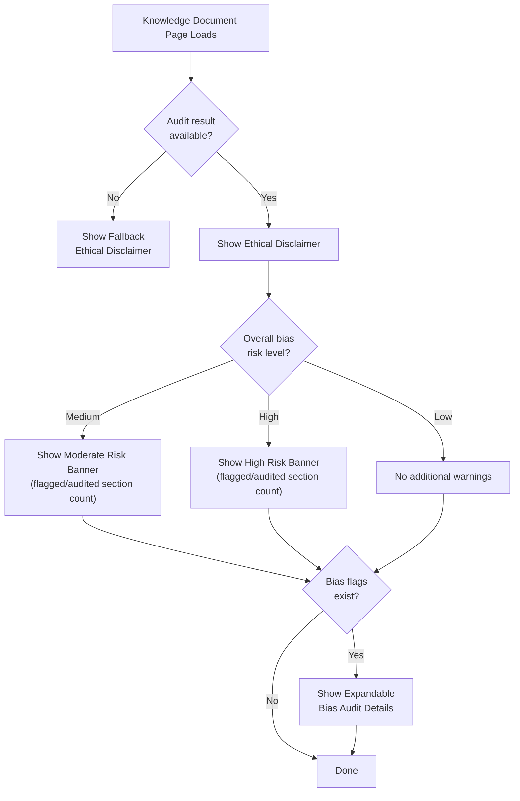
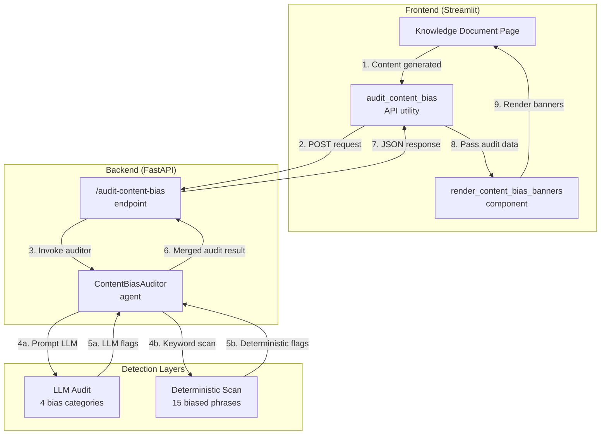

# Content Bias Auditor — Diagrams

## 1. Content Bias Auditor Pipeline Flow

## 2. Dual-Layer Detection Architecture

## 3. Frontend Rendering Decision Tree

## 4. Full-Stack Integration Diagram

